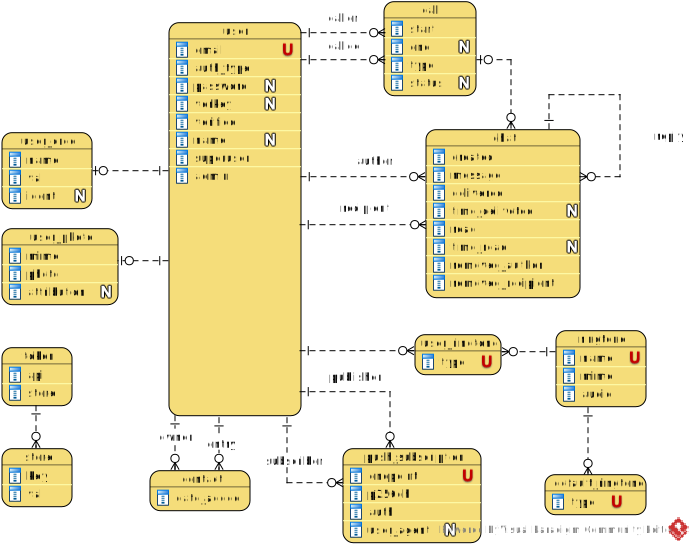

[In english](https://github.com/ciukstar/videre/blob/master/README.md)  

[În română](https://github.com/ciukstar/videre/blob/master/README.ro.md)  

[На русском](https://github.com/ciukstar/videre/blob/master/README.ru.md)

## Videre
Messagerie instantanée et appels vidéo

## Aperçu
L'application [Videre](https://viderefr-2pg7fq7tgq-de.a.run.app) permet aux utilisateurs d'échanger des messages instantanés via [WebSockets](https://developer.mozilla.org/fr/docs/Web/API/WebSockets_API), de passer des appels audio et vidéo via [WebRTC](https://developer.mozilla.org/fr/docs/Web/API/WebRTC_API) et d'être avertis via [Web Push](https://developer.mozilla.org/fr/docs/Web/API/Push_API).

## Usage
Pour s'appeler, les utilisateurs doivent [s'inscrire](https://viderefr-2pg7fq7tgq-de.a.run.app/auth/login) dans l'application et s'ajouter à leur liste de contacts parmi les utilisateurs enregistrés.

Lors de l'ajout d'un utilisateur à votre liste de contacts, l'application demandera l'autorisation d'envoyer des notifications et de s'abonner au service de notification push.

L'application utilise le service de notification push du navigateur pour informer l'appelé d'un appel vidéo ou audio entrant.

En acceptant l'appel, une session vidéo/audio cryptée peer-to-peer démarrera entre l'appelant et l'appelé comme décrit par [le protocole WebRTC](https://www.w3.org/TR/webrtc/).

## Superutilisateur

* Nom d'utilisateur  
  ```$YESOD_SUPERUSER_USERNAME```
* Mot de passe  
  ```$YESOD_SUPERUSER_PASSWORD```
  
Un compte superutilisateur est défini au moment du déploiement. Le superutilisateur gère les autres utilisateurs et accorde ou révoque les privilèges d'administrateur à des utilisateurs spécifiques.

## Intégration avec des API externes

* E-mail: [Gmail API](https://developers.google.com/gmail/api/guides?hl=fr)  

  * Identifiant client  
    ```$YESOD_GOOGLE_CLIENT_ID```
  * Secret client  
    ```$YESOD_GOOGLE_CLIENT_SECRET```

## Optimisation du moteur de recherche

* [Google SEO](https://search.google.com/search-console)

  ```$YESOD_GOOGLE_SITE_VERIFICATION```
  
* [Bing SEO](https://www.bing.com/webmasters)

  ```$YESOD_MS_VALIDATE```

## Entités de base

### Utilisateur
Un nouvel utilisateur peut [s'inscrire](https://viderefr-2pg7fq7tgq-de.a.run.app/auth/login) en utilisant un compte Google existant ou en utilisant une adresse e-mail vérifiée. [L'API Gmail](https://developers.google.com/gmail/api/guides?hl=fr) est utilisée comme intermédiaire pour envoyer des liens de vérification vers la boîte de réception de l'utilisateur.

Un utilisateur peut se voir attribuer le rôle d'administrateur par un superutilisateur ou par un autre administrateur. Seuls les utilisateurs disposant du rôle d'administrateur ont accès aux données administratives.

### Contact
Un contact est créé lorsqu'un utilisateur ajoute un autre utilisateur à sa liste de contacts. Si chaque utilisateur se trouve dans sa liste de contacts, il peut alors s'appeler.

### Abonnement push
Un abonnement push est créé lorsqu'un utilisateur est ajouté à sa liste de contacts, ou peut être différé ultérieurement.

L'abonnement peut être vérifié ou renouvelé à partir de l'élément de menu « Afficher le contact ».

[Les notifications Web Push](https://developer.mozilla.org/fr/docs/Web/API/Push_API) sont utilisées pour informer un appelé d'un appel vidéo/audio entrant. Il est également utilisé pour terminer la session vidéo/audio.

### L'entité "Chat"
...

## Diagramme ER



## Démo

[Cliquez ici pour voir la démo](https://viderefr-2pg7fq7tgq-de.a.run.app)

_* Cliquez sur le bouton [](https://viderefr-2pg7fq7tgq-de.a.run.app/auth/login) pour obtenir une liste des comptes d'utilisateurs de démonstration_
