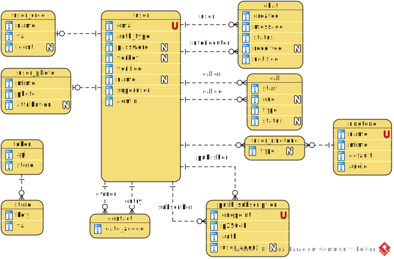
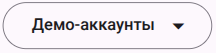

[In english](https://github.com/ciukstar/videre/blob/master/README.md)  

[En français](https://github.com/ciukstar/videre/blob/master/README.fr.md)  

[În română](https://github.com/ciukstar/videre/blob/master/README.ro.md)

## Videre
Мгновенные сообщения и видеозвонки

## Обзор
Приложение [Videre](https://videreru-2pg7fq7tgq-de.a.run.app) позволяет пользователям обмениваться мгновенными сообщениями через [WebSockets](https://developer.mozilla.org/ru/docs/Web/API/WebSockets_API), совершать аудио- и видеозвонки через [WebRTC](https://developer.mozilla.org/ru/docs/Web/API/WebRTC_API) и получать уведомления через [Web Push](https://developer.mozilla.org/ru/docs/Web/API/Push_API).

## Применение
Чтобы звонить друг другу, пользователям необходимо [зарегистрироваться](https://videreru-2pg7fq7tgq-de.a.run.app/auth/login) в приложении и добавить друг друга в свой список контактов из числа зарегистрированных пользователей.

При добавлении пользователя в список контактов приложение запросит разрешение на отправку уведомлений и подписку на службу push-уведомлений.

Приложение использует службу push-уведомлений браузера, чтобы уведомить вызываемого абонента о входящем видео- или аудиовызове.

Приняв вызов, между вызывающим абонентом и вызываемым абонентом начнется одноранговый зашифрованный сеанс видео/аудио, как описано в [протоколе WebRTC](https://www.w3.org/TR/webrtc/).

## Суперпользователь

* Имя пользователя  
  ```$YESOD_SUPERUSER_USERNAME```
* Пароль  
  ```$YESOD_SUPERUSER_PASSWORD```
  
Учетная запись суперпользователя определяется во время развертывания. Суперпользователь управляет другими пользователями и предоставляет или отзывает права администратора конкретным пользователям.

## Интеграция с внешними API

* Электронная почта: [Gmail API](https://developers.google.com/gmail/api/guides?hl=ru)  

  * Идентификатор клиента  
    ```$YESOD_GOOGLE_CLIENT_ID```
  * Секрет клиента  
    ```$YESOD_GOOGLE_CLIENT_SECRET```

* Коммуникации по сети в реальном времени: [WebRTC API](https://developer.mozilla.org/ru/docs/Web/API/WebRTC_API)  

  * Конфигурация  
    ```$YESOD_RTC_PEER_CONNECTION_CONFIG```  
    Конфигурация может быть предоставлена в виде текстового представления объекта JSON, как описано в [конструкторе RTCPeerConnection()](https://developer.mozilla.org/ru/docs/Web/API/RTCPeerConnection/RTCPeerConnection).  

    В основном используется для указания серверов STUN и TURN.

## Поисковая оптимизация

* [Google SEO](https://search.google.com/search-console)

  ```$YESOD_GOOGLE_SITE_VERIFICATION```
  
* [Bing SEO](https://www.bing.com/webmasters)

  ```$YESOD_MS_VALIDATE```
  
* [Yandex SEO](https://webmaster.yandex.com/welcome)

  ```$YESOD_YANDEX_VERIFICATION```

## Основные сущности

### Пользователь
Новый пользователь может [зарегистрироваться](https://videreru-2pg7fq7tgq-de.a.run.app/auth/login), используя существующую учетную запись Google или подтвержденный адрес электронной почты. [API Gmail](https://developers.google.com/gmail/api/guides?hl=ru) используется в качестве посредника для отправки ссылок проверки в почтовый ящик пользователя.

Пользователю может быть предоставлена роль администратора суперпользователем или другим администратором. Только пользователи с ролью администратора имеют доступ к административным данным.

### Контакт
Контакт создается, когда пользователь добавляет другого пользователя в свой список контактов. Если у каждого пользователя есть друг друга в списке контактов, они могут звонить друг другу.

### Push-подписка
Push-подписка создается при добавлении пользователя в список контактов или ее можно отложить.

Подписку можно проверить или продлить из пункта меню «Просмотреть контакт».

[Уведомления Web Push](https://developer.mozilla.org/ru/docs/Web/API/Push_API) используются для уведомления вызываемого абонента о входящем видео/аудио вызове. Он также используется для завершения видео/аудиосессии.

### Сущность «Вызов»
Сущность «Вызов» представляет исходящие и входящие звонки пользователю.

### Сущность «Чат»
Сущность «Чат» представляет сообщения, которыми обмениваются два пользователя. По умолчанию сообщения чата обмениваются и сохраняются с использованием протокола WebSockets. Одноранговый обмен сообщениями без промежуточного хранилища запланирован в будущих выпусках.

Поддержка форматирования текста с использованием Markdown.

### Рингтон
Новые рингтоны могут быть добавлены администратором в разделе [«Рингтоны»](https://videreru-2pg7fq7tgq-de.a.run.app/data/ringtones) меню «Данные».

Администратор также может установить мелодии звонка по умолчанию для каждого типа вызова, исходящего или входящего вызова.

Пользователи могут изменить предпочитаемые мелодии звонка в настройках своей учетной записи.

## ER-диаграмма



## Демо

[Нажмите здесь, чтобы увидеть демо](https://videreru-2pg7fq7tgq-de.a.run.app)

_* Нажмите на кнопку [](https://videreru-2pg7fq7tgq-de.a.run.app/auth/login), чтобы получить список демонстрационных учетных записей пользователей_
